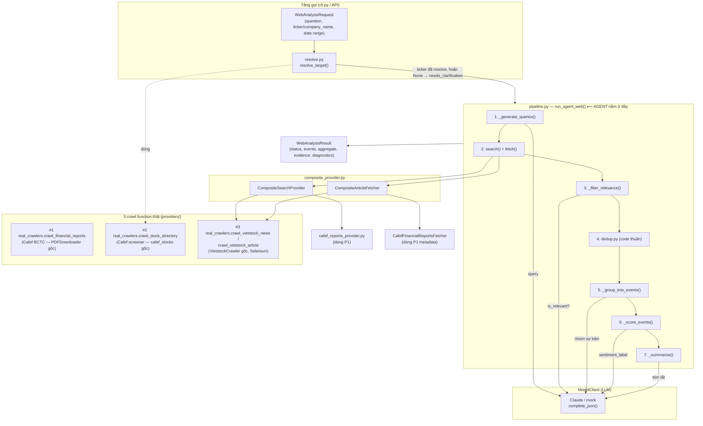

# Kiến trúc `agent_web` — 3 crawl function + agent nằm ở đâu

## 1. Sơ đồ luồng dữ liệu

## 2. "Agent" nằm ở đâu, và tại sao lại ở đó?

**"Agent" không phải một file hay một class riêng — nó là *vai trò ra quyết
định*, và vai trò đó được chia làm hai nửa nằm ở hai chỗ khác nhau một cách
có chủ đích:**

| Vai trò | Nằm ở đâu | Vì sao |
|---|---|---|
| **Ra quyết định "mềm"** (sinh query tìm kiếm, đánh giá bài nào liên quan, gộp bài nào cùng 1 sự kiện, chấm sentiment, viết tóm tắt) | **Bên trong LLM**, được gọi thông qua `ModelClient.complete_json()` | Đây là những việc cần **hiểu ngôn ngữ tự nhiên** — code Python không thể hardcode "thế nào là liên quan" hay "câu này tích cực hay tiêu cực" một cách đáng tin cậy. |
| **Điều phối** (gọi cái gì trước, cái gì sau, khi nào dừng, khi nào retry, giới hạn tài nguyên) | **`pipeline.py::run_agent_web()`** | Đây là nơi *duy nhất* biết toàn bộ trình tự nghiệp vụ (mục 4 trong spec): sinh query → search/fetch → lọc → gom sự kiện → chấm điểm → tổng hợp. Nó gọi ra `services.model_client` (não) và `services.search_provider`/`services.fetcher` (tay chân) nhưng **không tự mình đoán nghĩa** — nó chỉ đưa dữ liệu qua lại và validate. |
| **Lấy dữ liệu thô** (3 crawl function) | **`providers/`** | Đây là phần **tất định (deterministic)**, không cần "hiểu" gì cả — chỉ gọi HTTP/Selenium, parse HTML/JSON đúng cấu trúc đã biết trước. Vì vậy nó **không phải là agent**, dù nó thường bị nhầm là "phần agent đi crawl web". |
| **Toán học/logic chắc chắn** (`dedup.py`, `aggregate.py`, validator trong `models.py`) | **Code thuần, không gọi model** | Những phép tính này phải **tái lập được (reproducible)** và không được phép "trôi" theo cách LLM trả lời. VD: điểm sentiment tổng hợp luôn tính lại từ nhãn bằng bảng tra cứu cố định (`SENTIMENT_SCORE_MAP`), **không tin vào con số model tự trả**. |

Nói ngắn gọn: **agent = pipeline.py (bộ điều phối) + LLM (bộ ra quyết định
ngữ nghĩa) cộng lại**, còn 3 crawl function trong `providers/` chỉ là
**công cụ (tools)** mà agent gọi tới để lấy nguyên liệu — giống như một
người phân tích tài chính (agent) dùng công cụ tra cứu (Cafef, Vietstock)
để lấy tài liệu, rồi *chính người đó* mới là người đọc, gộp và đánh giá.
Tách rõ hai lớp này để:

1. **Test được không cần LLM thật** (`clients/mock_model_client.py` +
   `providers/mock_provider.py`) — mục 9 của spec.
2. **Đổi nguồn dữ liệu mà không đụng vào logic quyết định** — nếu mai này
   thay Vietstock bằng nguồn khác, chỉ cần viết `SearchProvider`/
   `ArticleFetcher` mới, `pipeline.py` không đổi 1 dòng.
3. **Không để LLM tự do làm phép tính** — điểm số, thống kê, provenance
   (evidence_id, content_hash, retrieved_at...) luôn do code Python sinh
   ra và kiểm tra lại, LLM chỉ được quyền gán *nhãn định tính*.

## 3. 3 crawl function được thêm — map với 3 file gốc bạn gửi

| # | File gốc bạn gửi | Hàm mới trong `providers/real_crawlers.py` | Dùng để làm gì trong agent |
|---|---|---|---|
| 1 | Cafef PDF downloader (`PDFDownloader`) | `crawl_financial_reports()` | Phát hiện sự kiện "vừa công bố báo cáo tài chính" (`cafef_reports_provider.py`) |
| 2 | Cafef stock-list crawler (`get_stocks_info`, `extract_json_data`...) | `crawl_stock_directory()` + `resolve_company()` | **Resolve** `company_name` ↔ `ticker` trước khi gọi `run_agent_web` (`resolve.py`) — không sửa nguyên tắc "không đoán doanh nghiệp" của pipeline |
| 3 | Vietstock news crawler (`VietstockCrawler`, Selenium) | `crawl_vietstock_news()` + `crawl_vietstock_article()` | Nguồn tin chính (`SearchProvider`/`ArticleFetcher` — `vietstock_provider.py`) |

Cả 3 được ghép lại bằng `composite_provider.py::build_real_services_providers()`
để tạo ra đúng 1 `SearchProvider` + 1 `ArticleFetcher` mà `WebAgentServices`
(interfaces.py) yêu cầu — pipeline.py hoàn toàn không biết có 3 nguồn bên
dưới, nó chỉ thấy "một provider".

## 4. Giới hạn còn lại (thành thật, không che giấu)

- `crawl_vietstock_news`/`crawl_vietstock_article` cần Selenium + Chrome
  thật → **không unit-test trực tiếp được** trong sandbox này (không có
  trình duyệt, không có mạng). Test đã viết (`tests/test_real_providers.py`)
  monkeypatch ở lớp `real_crawlers`, chỉ xác nhận phần *logic của provider*
  (lọc theo ngày, chặn URL nội bộ, xử lý lỗi) — không xác nhận được CSS
  selector của Vietstock còn đúng với giao diện hiện tại của họ hay không.
  Bạn cần chạy thật (có Chrome/chromedriver) để xác nhận điều đó.
- `CafefFinancialReportsFetcher` **không OCR/parse nội dung PDF** — chỉ trả
  metadata, và cố tình đánh dấu `content_scope="snippet"` để pipeline liệt
  kê đúng vào `limitations` thay vì chấm sentiment như thể đã đọc toàn văn.
